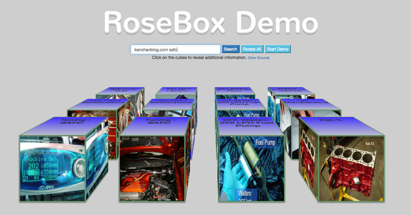

# RoseBox2 3D Content Search Utility (utilizing Angular JS)

## Note: Google Search API 1.0 has been discontinued - this demo currently does not work - will require a rewrite to use the new search via API KEYS (if interested, please send me a message for more information).

Hello, my name is Jack and this is a demonstration of a basic 3D content search utility.
At the moment, the app relies on Google Search Image Api 1.0 for sourcing its content.

## Goal
The goal of RoseBox is to create a starting point (MVP) for content search / aggregator utility
that groups and presents content in visual "tangible" blocks to the end user.


## How To Search Content

Simply enter the search terms inside the search text field and press ENTER or click on the SEARCH button beside it.

Afterwards, the first 4 results will be populated as cubes.  Each consecutive search yields 4 cubes stacking them
closer towards the viewer (you :)).  


## Content Cubes

To view description and title of each cube, you can either click on individual cube to keep rotating it to see
different sides / content OR click on the ROTATE ALL button to rotate all of the cubes at the same time.

The START DEMO button that appears after search rotates the cubes automatically every second.  Its purpose is purely for demonstration of cube grouping at the moment.

Please see screenshot below - this is what it looks like after performing 3 consecutive searches:




## Project structure
RoseBox2

```
index.html - html file linking css and scripts.
favicon.ico - icon for the app.
app.js - application module setup with constants.
world.controller.js - primary controller for the app.
  components/
    cubeset.factory.js - cubeset: creates, commands and destroys group of cubes.
    cube.factory.js - single cube operations (accessed by parent cubeset.factory.js)
    feedminer.factory.js - search data aggregator.

  style/
    style.css - style script for the app.
```

## Overview of component interaction

First index.html retrieves style/style.css and basic scripts for Angular, jQuery and Twitter Bootstrap.
Next Angular JS takes over initializing the application in app.js along with constants.  

Afterwards world.controller.js is initialized to handle the interactivity for the app and it is responsible for
initializing and mediating between CubeSet factory (which instantiates Cube factory) and FeedMiner (feedminer.factory.js).

When a search is run, World Controller notifies FeedMiner, which then gets results and set cube content via calls to individual
Cubes in the CubeSet.  Moving cubes in 3D space is done via commands sent from World Controller to the CubeSet
factory which then commands all cubes to move in tandem.


## Setup & deployment

It is client-side code so there is not much setup involved.  It relies on jQuery, Google Fonts, Bootstrap which
are remotely sourced.


## Bugs & Issues
I came up with this idea quickly and it is very MVPish...

* At the moment there is no alignment routine in place to ensure the cubes are centered to the screen.
* Very minimal validation / error checking.
* No clear-search button.
* No search-recommendations.
* No server-side processing.

yet...


## Compatibility

I have tested it on several versions of Firefox, Safari and Chrome (desktop).  I have tested it on ipad mini and
few phones (due to scaling - it's primarily a desktop / tablet app).
